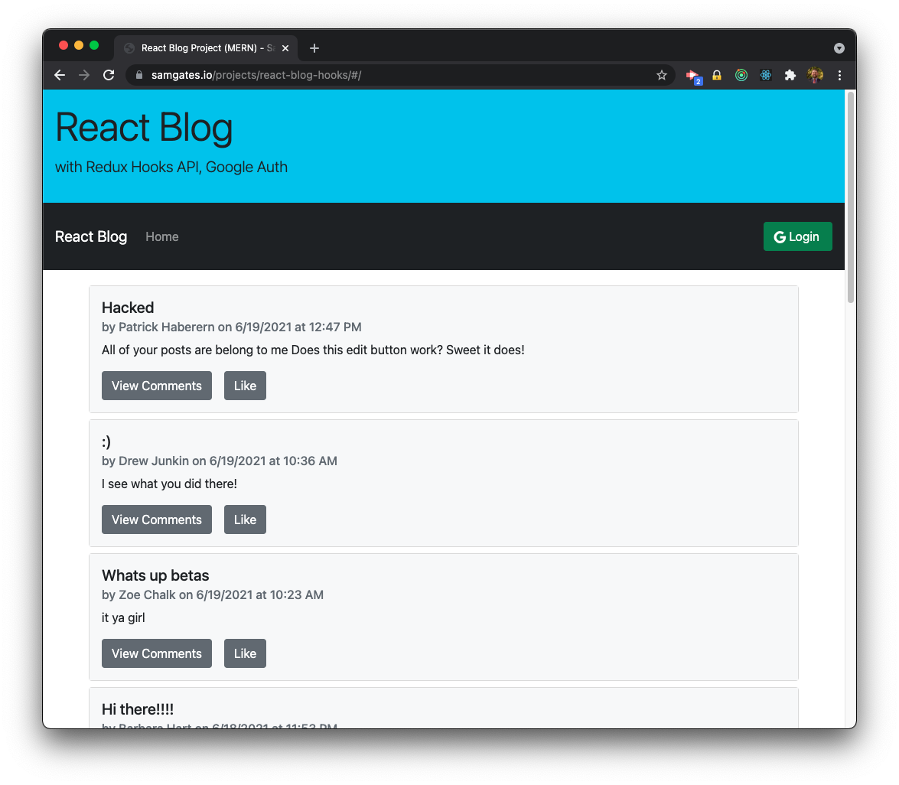
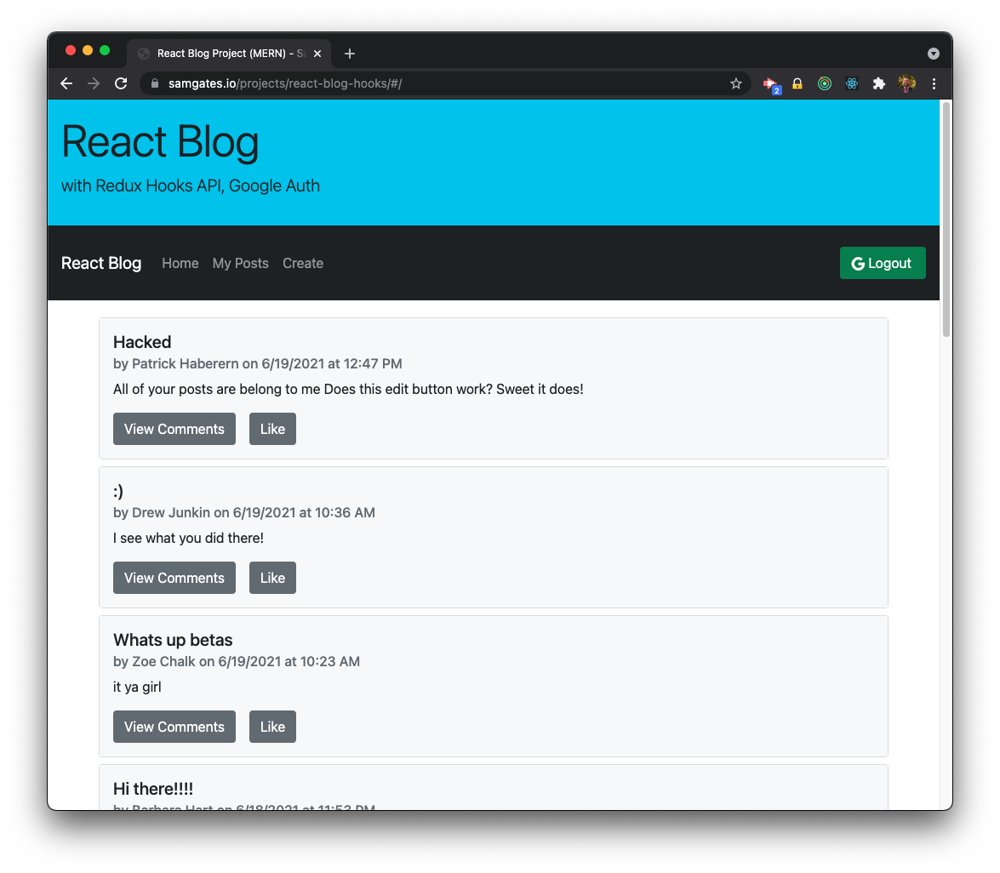
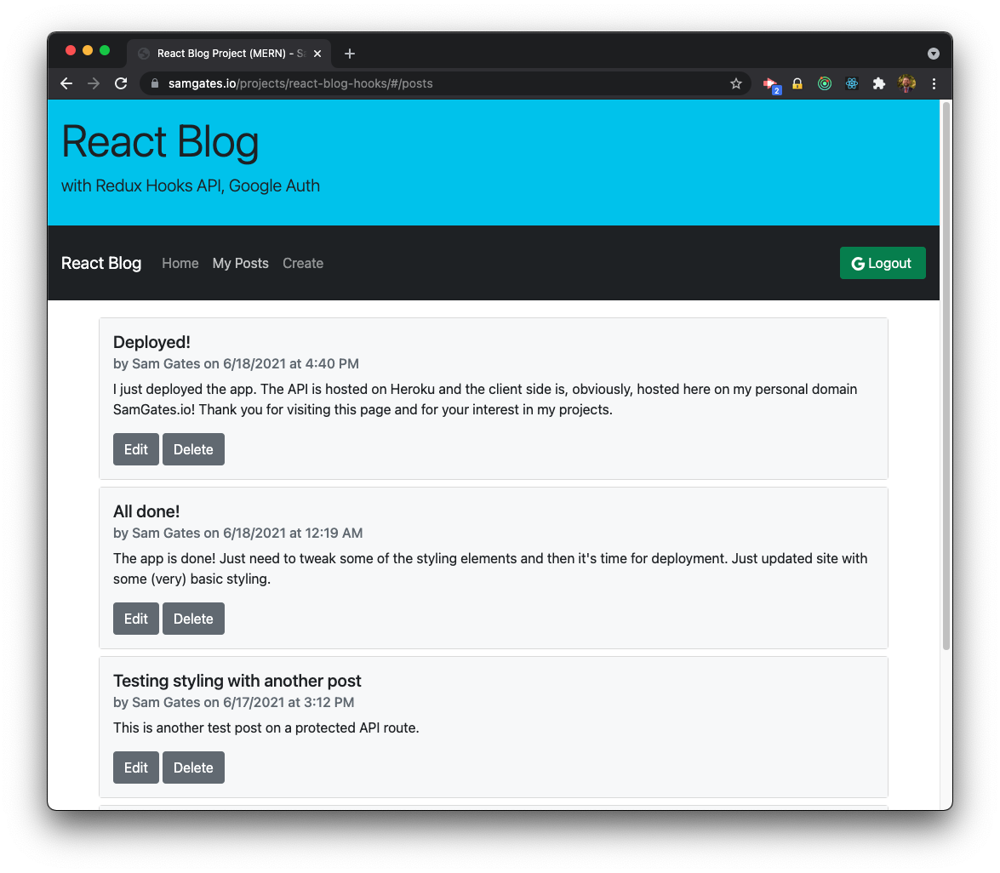

# React Blog - Redux Hooks

## Description

For this project, I updated the client-side of my [React Blog](https://github.com/sg0703/React_Blog) app.

React Blog is a full stack MERN application. I rewrote the frontend using Redux Hooks, utilized a new library for Google Sign-In, and updated styling with Bootstrap. This app uses a custom backend (REST API) that I built using Node and Express. The API has protected routes that use Google's Sign In API to verify tokens before allowing access. The backend manages a MongoDB Atlas database.

The frontend is hosted on my personal domain. The backend is hosted on Heroku and for the database I used MongoDB Atlas.

The app is deployed on my personal domain. Check it out [here](https://samgates.io/projects/react-blog-hooks/)!

## Table of Contents

- [Installation](#installation)
- [Usage](#usage)
- [Contribute](#contribute)
- [Test](#test)
- [License](#license)
- [Future Features](#future-features)
- [Questions](#questions)

## Installation

Clone the repo or download the files!

## Usage

Usage Instructions

## Contribute

Let me know if you have any thoughts on how to improve, future features, etc.

## Test

Go to the deployed version, sign in with Google, and start writing posts!

## License

Copyright (c) Sam Gates. All rights reserved.
Licensed under the [MIT](https://opensource.org/licenses/MIT) license.

## Future Features

- Liking posts
- User pages
- Register for an account
- Custom user database and login system

## Questions

Check out my [GitHub Profile](https://github.com/sg0703). Email with questions! You can reach me at sam.j.gates@gmail.com.
